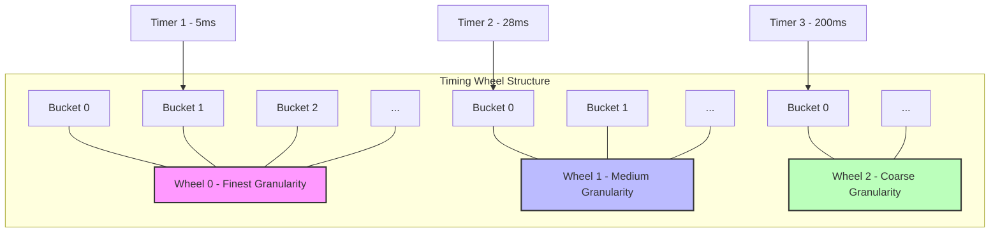
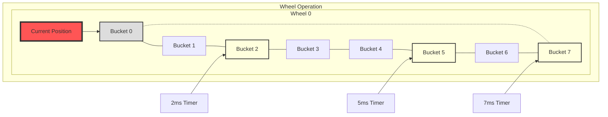
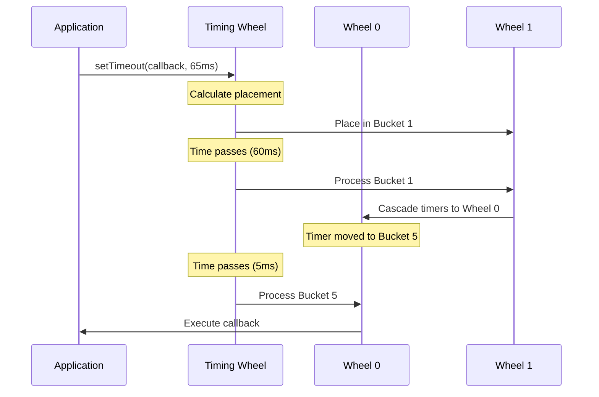

# timer

A high-performance timing wheel based timer implementation for Node.js, fully compatible with the native Node.js timer interface.

## Features

- **Drop-in Replacement**: Fully compatible with Node.js timer interfaces (`setTimeout`, `setInterval`, `clearTimeout`, `clearInterval`) and `NodeJS.Timeout`
- **High Performance**: Significantly faster than native Node.js timers, especially when managing thousands of timers
- **O(1) Time Complexity**: Constant time operations regardless of the number of active timers
- **Memory Efficient**: Optimized memory usage with smart bucket management and relative time tracking
- **Event Loop Control**: Full support for `ref()` and `unref()` methods to control event loop behavior
- **Promise Support**: Compatible with `util.promisify` for promise-based interfaces

## Timing Wheel Algorithm

The timing wheel algorithm is an efficient data structure for managing timers with O(1) time complexity, unlike traditional approaches that use sorted lists or min-heaps with O(log n) complexity.

### How It Works

1. **Hierarchical Structure**: Multiple wheel layers represent different time granularities
2. **Bucket System**: Each wheel contains multiple buckets, each representing a specific time slot
3. **Timer Placement**: Timers are placed in appropriate buckets based on execution time
4. **Cascading Mechanism**: As time progresses, timers from higher layers "cascade down" to lower layers



### Single Wheel Operation

As the current position advances around each wheel, timers in each bucket are executed when their time slot is reached.



### Visual Example: Timer Processing



This implementation includes several optimizations that result in superior performance and memory efficiency, particularly when managing large numbers of timers.

## Installation

```bash
npm install https://github.com/qwp0905/timer
# or
yarn add @qwp0905/timer@https://github.com/qwp0905/timer
```

## Usage

### Drop-in Replacement for Node.js Timers

```typescript
import { setGlobalTimers, clearGlobalTimers } from "timer"

// Override native Node.js timer functions
setGlobalTimers()

// Use standard Node.js timer API - now powered by timing wheel
setTimeout(() => console.log("This uses timing wheel!"), 1000)

const interval = setInterval(() => {
  console.log("Running every 2 seconds")
}, 2000)

// Clear interval using standard Node.js API
clearInterval(interval)

// Restore original Node.js timer functions if needed
clearGlobalTimers()
```

### Direct TimingWheel Usage

```typescript
import { TaskScheduler } from "timer"

const scheduler = new TaskScheduler()

// Register a timeout
const timeout = scheduler.setTimeout(() => {
  console.log("Timeout executed!")
}, 1000)

// Timeout fully implements NodeJS.Timeout interface
timeout.ref() // Keep event loop running (default)
timeout.unref() // Allow process to exit if this is the only timer

// Refresh the timeout (reset the timer)
timeout.refresh()

// Register an interval
const interval = scheduler.setInterval(() => {
  console.log("Interval executed!")
}, 2000)

// Cancel timers
timeout.close() // or scheduler.clearTimeout(timeout)
interval.close() // or scheduler.clearInterval(interval)
```

### Using with Promises

```typescript
import { setGlobalTimers } from "timer"
import { promisify } from "util"

setGlobalTimers()

// Convert setTimeout to a Promise-based delay function
const sleep = promisify(setTimeout)

async function example() {
  console.log("Starting")
  await sleep(1000) // Wait 1 second
  console.log("After 1 second")
}

example()
```

## Use Cases

This library is particularly valuable in these scenarios:

1. **High-throughput Server Applications**: Systems managing thousands of concurrent connections, each potentially needing timers (e.g., WebSocket servers, connection timeouts)

2. **Real-time Systems**: Applications where timer precision and performance directly impact user experience

3. **Game Servers**: Managing numerous game mechanics, player timeouts, and scheduled events

4. **Trading/Financial Systems**: Where timing precision and performance can have significant business impact

5. **IoT Platforms**: Managing many device connections with various timing requirements

6. **Task Scheduling Systems**: Applications scheduling and managing many tasks with different timing requirements

## Performance Benchmarks

Tests with 1 million timers show significant performance improvements over native Node.js timers:

| Operation          | Native Node.js | Timing Wheel | Improvement |
| ------------------ | -------------- | ------------ | ----------- |
| Timer Creation     | 1049ms         | 555ms        | ~47% faster |
| Timer Cancellation | 377ms          | 74ms         | ~80% faster |
| Memory Usage       | Lower          | Higher       | Trade-off   |

Performance advantage increases with the number of active timers. The implementation prioritizes execution speed over memory efficiency, making it ideal for high-throughput applications where timer performance is critical.

## License

Apache License 2.0
